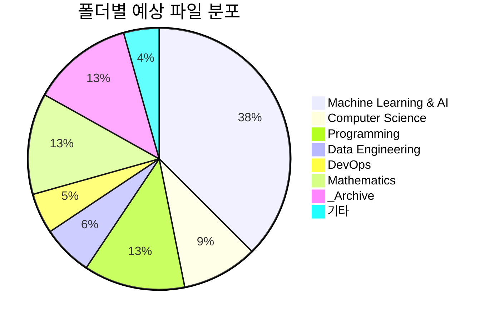
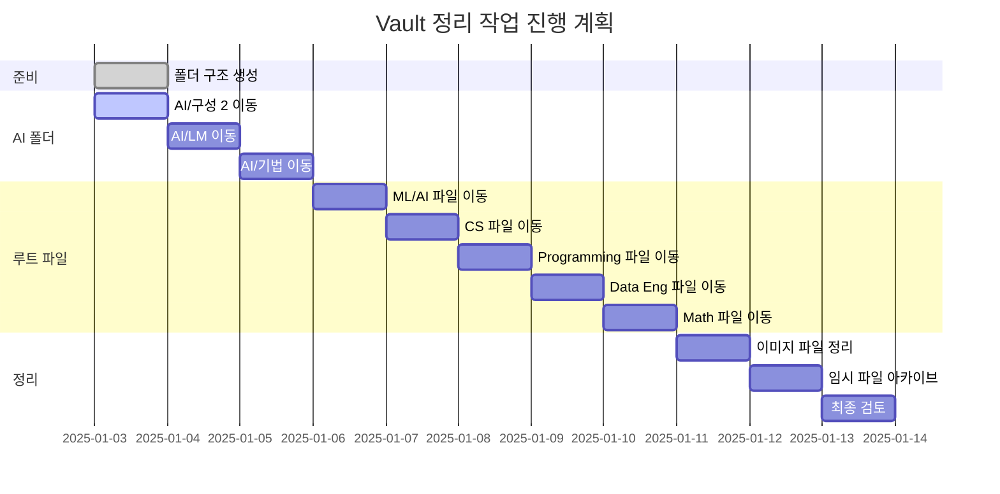

# Obsidian Vault 폴더 구조 다이어그램

## 전체 구조 개요

```mermaid
graph TD
    Root[📚 Vault Root]
    
    Root --> ML[🤖 Machine Learning & AI]
    Root --> CS[💻 Computer Science]
    Root --> Prog[⌨️ Programming]
    Root --> DE[🔧 Data Engineering]
    Root --> DO[☁️ DevOps]
    Root --> Math[📐 Mathematics]
    Root --> Archive[📦 _Archive]
    Root --> Images[🖼️ Images]
    Root --> Tags[🏷️ Tags]
    
    ML --> MLF[Fundamentals]
    ML --> MLM[Models]
    ML --> MLLM[Language Models]
    ML --> MLT[Techniques]
    ML --> MLNN[Neural Networks]
    ML --> MLD[Datasets]
    ML --> MLE[Evaluation]
    ML --> MLX[XAI]
    
    CS --> CSOS[Operating Systems]
    CS --> CSOOP[OOP]
    
    Prog --> ProgPy[Python]
    Prog --> ProgJava[Java]
    Prog --> ProgC[C]
    Prog --> ProgGit[Git]
    
    DE --> DEDB[Databases]
    DE --> DEETL[ETL & Pipelines]
    DE --> DES[Storage]
    
    DO --> DOK[Kubernetes]
    DO --> DOC[Cloud]
    
    Math --> MathS[Statistics]
    Math --> MathLA[Linear Algebra]
    
    style Root fill:#e1f5ff
    style ML fill:#fff4e1
    style CS fill:#e8f5e8
    style Prog fill:#f5e8ff
    style DE fill:#ffe8e8
    style DO fill:#e8f8ff
    style Math fill:#fff0f0
    style Archive fill:#f0f0f0
```



## 상세 폴더 구조 (트리 형태)

```
📚 Vault Root/
├── 🤖 Machine Learning & AI/
│   ├── 📖 Fundamentals/
│   │   ├── Gradient.md
│   │   ├── Gradient Descent.md
│   │   ├── Loss Function.md
│   │   ├── Overfitting.md
│   │   └── ... (최적화, 정규화 등)
│   │
│   ├── 🏗️ Models/
│   │   ├── CNN.md
│   │   ├── GAN.md
│   │   ├── Decision Tree.md
│   │   └── ... (모델 구조)
│   │
│   ├── 🗣️ Language Models/
│   │   ├── BERT.md
│   │   ├── GPT.md
│   │   ├── LLM.md
│   │   └── ... (언어 모델)
│   │
│   ├── 🛠️ Techniques/
│   │   ├── Fine-tuning.md
│   │   ├── LoRA.md
│   │   ├── PEFT.md
│   │   └── ... (학습 기법)
│   │
│   ├── 🧠 Neural Networks/
│   │   ├── Transformer.md
│   │   ├── LSTM.md
│   │   ├── Attention Mechanism.md
│   │   └── ... (신경망 구조)
│   │
│   ├── 📊 Datasets/
│   │   ├── MELD.md
│   │   ├── COSMIC.md
│   │   └── ... (데이터셋)
│   │
│   ├── 📏 Evaluation/
│   │   ├── BLEU.md
│   │   └── ... (평가 지표)
│   │
│   └── 🔍 XAI/
│       ├── SHAP.md
│       └── ... (설명가능 AI)
│
├── 💻 Computer Science/
│   ├── 🖥️ Operating Systems/
│   │   ├── CPU Scheduling.md
│   │   ├── Memory Virtualization.md
│   │   ├── File System.md
│   │   └── ... (OS 관련)
│   │
│   └── 🎯 OOP/
│       └── Object-Oriented Programming.md
│
├── ⌨️ Programming/
│   ├── 🐍 Python/
│   │   ├── Python.md
│   │   ├── PyTorch.md
│   │   ├── TensorFlow.md
│   │   └── ... (Python 라이브러리)
│   │
│   ├── ☕ Java/
│   │   └── JAVA.md
│   │
│   ├── 🔤 C/
│   │   ├── C Language.md
│   │   └── ... (C 관련)
│   │
│   └── 🌿 Git/
│       ├── Git.md
│       ├── Git-Flow.md
│       ├── Github-Flow.md
│       └── ... (버전 관리)
│
├── 🔧 Data Engineering/
│   ├── 🗄️ Databases/
│   │   ├── RDB.md
│   │   ├── NoSQL.md
│   │   ├── MongoDB.md
│   │   └── ... (데이터베이스)
│   │
│   ├── 🔄 ETL & Pipelines/
│   │   ├── Apache Airflow.md
│   │   ├── Kafka.md
│   │   └── ... (데이터 파이프라인)
│   │
│   └── 💾 Storage/
│       ├── 데이터 레이크.md
│       └── 데이터 웨어하우스.md
│
├── ☁️ DevOps/
│   ├── ⚓ Kubernetes/
│   │   └── Kubernetes.md
│   │
│   └── 🌐 Cloud/
│       ├── Amazon EC2.md
│       ├── Google.md
│       ├── Microsoft.md
│       └── ... (클라우드 서비스)
│
├── 📐 Mathematics/
│   ├── 📊 Statistics/
│   │   ├── Regression Analysis.md
│   │   ├── 베이지안 추론.md
│   │   ├── 확률론.md
│   │   └── ... (통계학)
│   │
│   └── 📈 Linear Algebra/
│       ├── Vector Similarity.md
│       ├── Cosine Similarity.md
│       ├── Euclidean Distance.md
│       └── ... (선형대수)
│
├── 📦 _Archive/
│   ├── 무제.md
│   ├── Untitled.md
│   └── ... (임시 파일)
│
├── 🖼️ Images/
│   └── ... (이미지 파일들)
│
└── 🏷️ Tags/
    └── ... (태그 관련)
```

## 폴더별 파일 수 예상



## 정리 진행도



## 색상 범례

- 🤖 **노란색**: Machine Learning & AI - 가장 큰 카테고리
- 💻 **초록색**: Computer Science - 기초 이론
- ⌨️ **보라색**: Programming - 언어 및 도구
- 🔧 **빨간색**: Data Engineering - 데이터 처리
- ☁️ **하늘색**: DevOps - 운영 및 배포
- 📐 **분홍색**: Mathematics - 수학 기초
- 📦 **회색**: Archive - 보관 파일

---

**생성일**: 2025-01-03  
**목적**: Vault 재구성 가이드  
**상태**: Phase 1 완료 (폴더 구조 생성)
